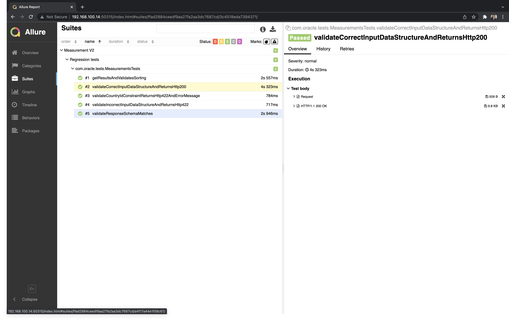

# OpenAQ API Test Automation Framework
Test Automation framework to automate test scripts execution for OpenAQ API

How to run the Tests?
---
There is a suite.xml file named *api_v2_measurement_suite.xml*, so using Maven just with the following command: 

```sh
mvn test -Dsuite=api_v2_measurement_suite.xml
```
To open the Allure report generated. From the project folder:
---
```sh
allure serve target/allure-results
```


What do I need to run these samples?
---
A Java 8 JDK and Maven

What API is used for the samples?
---
The code samples invoke the [OpenAQ API](https://docs.openaq.org/).

